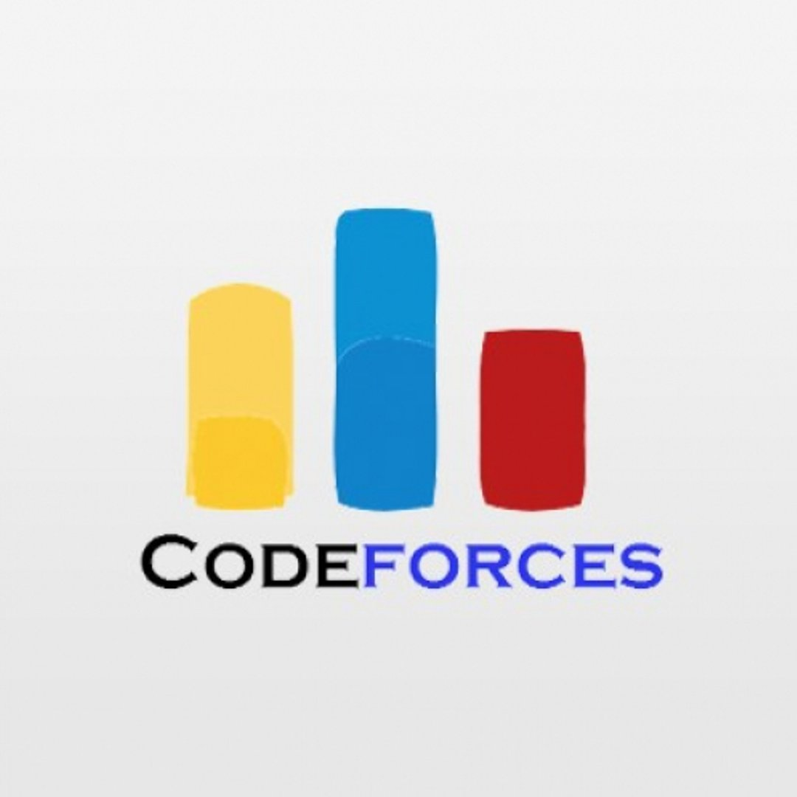

<h1 align="center">Hi 👋, I'm Tathagata Sur</h1>
<h3 align="center">A passionate competitive programmer and web developer from India</h3>

- � Ask me about **Java, Python, C, C++, Linux/Unix Shell**
- 📫 How to reach me **tathagatasur94@gmail.com**

## 🌐 Connect with me:

  
  
  
  
  

## 💻 Languages and Tools:
 
 
 
 
 
<!-- 
 
 -->
 
 

## � GitHub Stats:

  

&nbsp;

  

